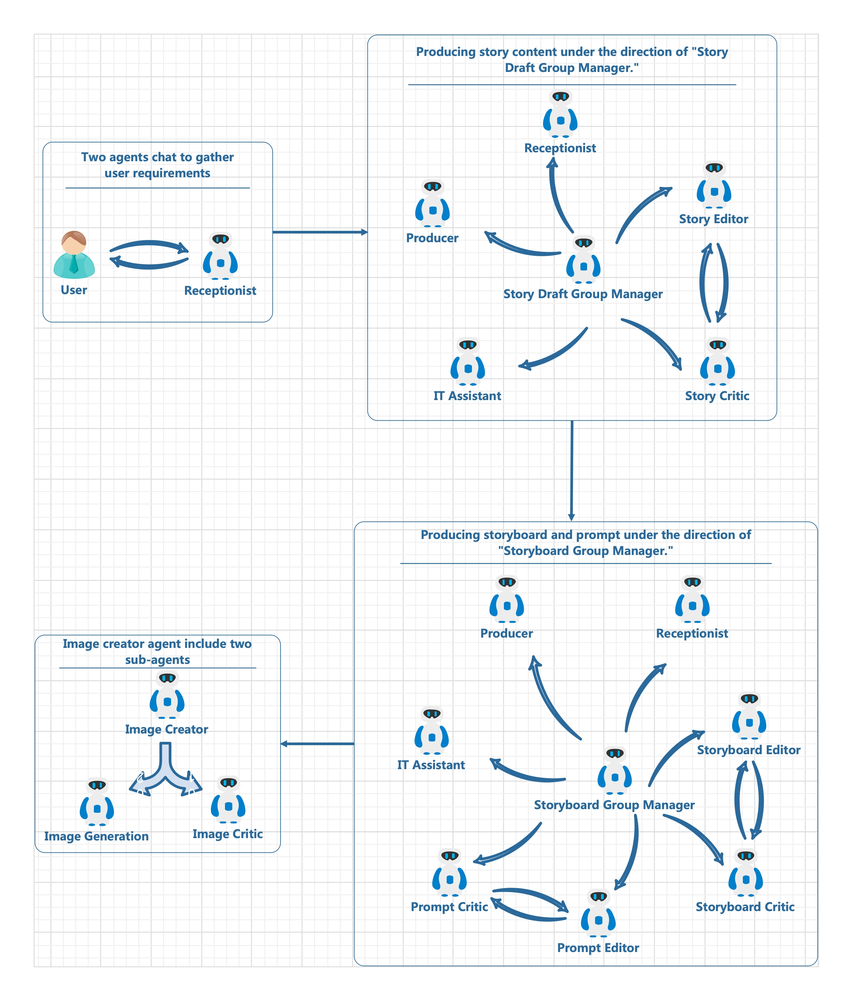

[English](README.md)
[中文版](README.zh-cn.md)

## エージェンティックストーリーブックワークフロー
[AutoGen](https://microsoft.github.io/autogen/) に基づく子供向け絵本作成のためのマルチエージェントワークフローフレームワーク。

https://github.com/user-attachments/assets/323d055a-27d9-487f-b8c4-2fad2df649cc

## エージェンティックワークフロー

コードには、AutoGen に基づくさまざまなマルチエージェント コラボレーション方法が含まれています。例えば：
- 最初に、User_Proxy がユーザーを表し、Receptionist と通信してユーザーの要件を収集します。
- 次の 2 つの段階では、GroupChat メカニズムが使用され、各 GroupChat には現在の GroupChat のスピーカーを調整する GroupChat マネージャーがいます。
- 2 つのグループチャットでは、コンテンツ作成の役割 (ストーリー エディター、ストーリーボード エディター、プロンプト エディターなど) に、コンテンツを確認するエージェントが伴います。レビューが承認されない場合、GroupManager はコンテンツ作成エディターに送信して修正を行います。
- 画像/ビデオ/PPT の生成の最終段階は、現在のところ、使用の容易さと将来のグループチャットの編成の潜在的な調整のために、別のコード (generate.py) に配置されています。この部分は一時的に Image Creator Agent によって処理されます。これは独立したエージェントですが、内部には 2 つのサブエージェントが含まれています。1 つは AI ベースの画像生成を担当する画像生成エージェントで、もう 1 つは生成された画像を確認するエージェントです。

## システム要件
- **LLM**: ChatGPT-4o の使用をお勧めします。現在のコードは、Azure OpenAI の ChatGPT-4o サービスに基づいてテストされています。理論的には、構成を少し調整するだけで OpenAI のネイティブ サービスもサポートするはずです。AutoGen は複数の LLM をサポートしていますが、Claude 3.5 ソネットを使用した実際のテストでは、プロンプトの指示に 100% 厳密に従うことができないことがわかったため、他の LLM はお勧めしません。
- **Text2Image**: DALL-E 3 と Replicate の Flux Schnell をサポートします。コストと速度を考慮して、最終的に Replicate の Flux Schnell API エンドポイントを選択しました。なぜなら
  - HD モードの DALL-E 3 を使用すると、100 枚の画像あたり 12 ドルの費用がかかり、つまり 1 枚の画像あたり 0.12 ドルの費用がかかり、各画像の生成には 10 秒以上かかります。
  - Flux Schnell API サービスを使用すると、1 枚の画像のコストはわずか 0.003 ドルで、描画時間は 1 ～ 2 秒です。コストとスケジューリングの観点から、Flux Schnell がより適しているようです。たとえ Schnell バージョンの品質が低いと感じても、Flux Dev バージョンの API を使用するコストはわずか 0.03 ドルです (Replicate の pro バージョンのコストは 0.055 ドルですが、CPU で実行されているようで非常に遅いため、試していません)。ニーズに応じて調整できます。
- スピーチ サービス リソースが有効になっている Azure アカウント。

## 使用方法
- Python 仮想環境を作成し (Python 3.11 でテスト済み)、依存関係をインストールします。
```
pip install -r requirements.txt
```
- .env ファイルを作成し、.env.example の内容をコピーして、設定に合わせて変更します。ストーリーを作成する
```
python app.py
```
- 画像/ビデオ/PPTX を生成します。まず、generate.py の story_id を生成したいストーリー ID に変更します (app.py の出力から取得します)。次に実行します。
```
python generate.py
```

## .env 構成
|環境名|説明 |デフォルト値|
|:-----|:----|:-----:|
|AGENTOPS_API_KEY| [AgentOps](https://app.agentops.ai/) API キー| |
|MODEL|Azure のデプロイ名または OpenAI のモデル名 | |
|API_VERSION|API バージョン|'2024-06-01'|
|API_TYPE|'azure' または 'openai'|azure|
|API_KEY|API キー| |
|BASE_URL|API ベース URL、Azure の場合は 'https://{region_name}.openai.azure.com/' のようになります||
|IMAGE_GENERATION_TYPE|'azure'、'openai' または 'replicate'||
|IMAGE_SHAPE|'landscape'、'portrait' または 'square'|landscape|
|DALLE_MODEL|Azure のデプロイ名または OpenAI のモデル名 | |
|DALLE_API_VERSION|API バージョン|'2024-06-01'|
|DALLE_API_KEY|API キー| |
|DALLE_BASE_URL|API ベース URL、Azure の場合は 'https://{region_name}.openai.azure.com/' のようになります||
|DALLE_IMAGE_QUALITY|'hd' または 'standard'|'hd'|
|DALLE_IMAGE_STYLE|'vivid' または 'natural'|'vivid'|
|REPLICATE_API_TOKEN|[repilicate](https://replicate.com/) API キー| |
|REPLICATE_MODEL_NAME| 'black-forest-labs/flux-schnell'、'black-forest-labs/flux-dev' または 'black-forest-labs/flux-pro'|'black-forest-labs/flux-schnell'|
|IMAGE_GENERATION_RETRIES|画像ごとの最大再試行回数|3|
|IMAGE_CRITICISM_RETRIES|画像ごとの最大批評回数|2|
|IMAGE_SAVE_FAILURED_IMAGES|批評に失敗した画像を保存する:True または False|False|
|AZURE_SPEECH_KEY|Azure 音声 API キー||
|AZURE_SPEECH_REGION|Azure 音声デプロイ リージョン||
|AZURE_SPEECH_VOICE_NAME|Azure 音声スピーカー名|'zh-CN-XiaoxiaoMultilingualNeural'|

## ロードマップ
- [ ] さらに多くの FLUX モデルとチャネルを追加
- [ ] コンテンツ生成のロジックを改善する
- [ ] ストーリー コンテンツの作成と生成中に「ループ内の人間」ロジックを追加する
- [ ] バックグラウンドミュージック

## FAQ
- **デモのストーリーコンテンツが中国語ですが、他の言語に対応していますか？**
  はい、対応しています。コンテンツ作成のプロンプトセクションには、ユーザーの要件またはユーザーが使用する言語に従うように指示があります。
- **多言語音声サポートはどうですか？**
  Azure の TTS は数百の言語をサポートしています。必要な言語の音声名を .env ファイルの AZURE_SPEECH_VOICE_NAME フィールドに指定するだけです (一部の音声は数十の異なる言語をサポートしています)。
- **なぜプロンプトが英語で書かれているのですか？**
  間違いなく、英語のプロンプトは中国語のプロンプトよりも効果的です。非常に便利なヒントとして、Anthropic のポータルにはプロンプトを生成するツールがあります。そこに初期のアイデアを入力すると、プロンプトを生成するのに役立ちます。少し修正するだけでプログラムで使用できます。
- **視覚品質が低いようです**
  ここには 2 つの要因があります。
  - まず、現在表示されているテストコンテンツは、速度が速くコストが低い Flux の Schnell モデルを使用しています。dev または pro モデルを使用すると、画像の視覚品質が向上することは間違いありません。これらのモデルは現在のコードではサポートされていませんが、将来的には追加される予定です。
  - 第二に、既存の画像レビュー ロジックは不十分であり、改善の余地があります。

## その他
[ここで生成されたコンテンツのデモをいくつか参照してください](DEMO-Results.md)
