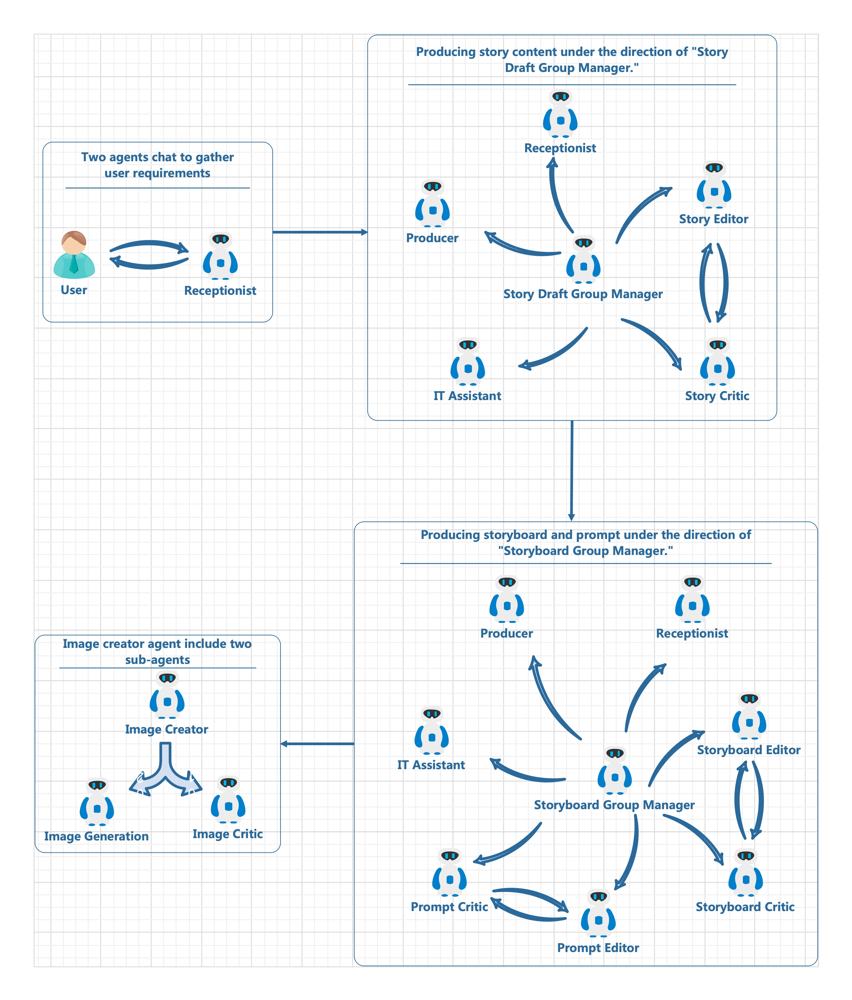

[中文版](README.zh-cn.md)
[日本語](README.ja-jp.md)

## Agentic Story Book Workflow
A multi-agent workflow framework for creating children's picture books based on [AutoGen](https://microsoft.github.io/autogen/).


https://github.com/user-attachments/assets/323d055a-27d9-487f-b8c4-2fad2df649cc

## Agentic workflow

The code involves various multi-agent collaboration methods based on AutoGen. For example:
- Initially, the User_Proxy represents the user and communicates with the Receptionist to gather user requirements.
- In the subsequent two stages, the GroupChat mechanism is used, with each GroupChat having a GroupChat Manager to coordinate the speakers in the current GroupChat.
- In the two GroupChats, the content creation roles (e.g., Story Editor, Storyboard Editor, Prompt Editor) are accompanied by an Agent responsible for reviewing the content. If the review is not approved, the GroupManager sends it back to the content creation Editor for revision.
- The final stage of generating images/videos/PPTs is currently placed in separate code (generate.py) for ease of use and potential future adjustments to the GroupChat organization. This part is temporarily handled by an Image Creator Agent, which is an independent Agent but contains two Sub-Agents internally: an Image Generation Agent responsible for AI-based image generation and another for reviewing the generated images.

## System Requirements
- **LLM**: It is recommended to use ChatGPT-4o. The current code is tested based on the ChatGPT-4o service in Azure OpenAI. In theory, it should also support OpenAI's native services with minor configuration adjustments. Although AutoGen supports multiple LLMs, practical tests with Claude 3.5 sonnet showed that it could not strictly follow the instructions in the Prompt 100% of the time, so other LLMs are not recommended.
- **Text2Image**: Supports DALL-E 3 and Flux Schnell from Replicate. Considering cost and speed, I ultimately chose the Flux Schnell API endpoint from Replicate because:
  - Using DALL-E 3 in HD mode costs $12/100 images, meaning $0.12 per image, and each image takes more than ten seconds to generate.
  - Using the Flux Schnell API service costs only $0.003 per image, with a drawing time of 1-2 seconds. From a cost and scheduling perspective, Flux Schnell seems more suitable. Even if you find the quality of the Schnell version low, using the Flux Dev version API costs only $0.03 per image (the pro version on Replicate costs $0.055, but it seems to run on CPU and is very slow, so I didn't try it). You can adjust according to your needs.
- Azure account with Speech service resources enabled.

## How to use
- Create a Python virtual environment (tested on Python 3.11) and install dependencies:
```
pip install -r requirements.txt
```
- Create a .env file, copy the contents from .env.example, and modify it with your settings. Create a story
```
python app.py
```
- Generate images/videos/PPTX: First, modify the story_id in generate.py to the story ID you want to generate (obtained from the output of app.py). Then run:
```
python generate.py
```


## .env configurations
|Enviroment Name|Description |Default Value|
|:-----|:----|:-----:|
|AGENTOPS_API_KEY| [AgentOps](https://app.agentops.ai/) API Key| |
|MODEL|deployment name on azure or model name on OpenAI | |
|API_VERSION|API Version|'2024-06-01'|
|API_TYPE|'azure' or 'openai'|azure|
|API_KEY|API Key| |
|BASE_URL|API base url,  Azure should be like 'https://{region_name}.openai.azure.com/'||
|IMAGE_GENERATION_TYPE|'azure', 'openai' or 'replicate'||
|IMAGE_SHAPE|'landscape', 'portrait' or 'square'|landscape|
|DALLE_MODEL|deployment name on azure or model name on OpenAI | |
|DALLE_API_VERSION|API Version|'2024-06-01'|
|DALLE_API_KEY|API Key| |
|DALLE_BASE_URL|API base url, Azure should be like 'https://{region_name}.openai.azure.com/'||
|DALLE_IMAGE_QUALITY|'hd' or 'standard'|'hd'|
|DALLE_IMAGE_STYLE|'vivid' or 'natural'|'vivid'|
|REPLICATE_API_TOKEN|[repilicate](https://replicate.com/) api key| |
|REPLICATE_MODEL_NAME| 'black-forest-labs/flux-schnell', 'black-forest-labs/flux-dev' or 'black-forest-labs/flux-pro'|'black-forest-labs/flux-schnell'|
|IMAGE_GENERATION_RETRIES|max retry count per image|3|
|IMAGE_CRITICISM_RETRIES|max critic count per image|2|
|IMAGE_SAVE_FAILURED_IMAGES|save the critic failed image:True or False|False|
|AZURE_SPEECH_KEY|Azure voice API Key||
|AZURE_SPEECH_REGION|Azure voice deploy region||
|AZURE_SPEECH_VOICE_NAME|Azure voice speaker name|'zh-CN-XiaoxiaoMultilingualNeural'|


## Roadmap
- [ ] Add more FLUX models and channels
- [ ] Improve the logic of content generation
- [ ] Add "human-in-the-loop" logic during story content creation and generation
- [ ] Background music


## FAQ
- **I see that the story content in your demo is in Chinese. Does it support other languages?**
  Yes, it does. In the prompt section for content creation, there are instructions to follow the user's requirements or the language used by the user.
- **What about multilingual voice support?**
  Azure's TTS supports hundreds of languages. You just need to specify the desired language's voice name in the AZURE_SPEECH_VOICE_NAME field in the .env file (some voices support dozens of different languages).
- **Why are your prompts written in English?**
  Undoubtedly, English prompts are slightly more effective than Chinese ones. A very useful tip is that there is a tool in Anthropic's Portal that helps you generate prompts. You can input your initial ideas there, and it will help you generate prompts that you only need to modify slightly before using them in your program.
- **The visual quality seems low**
  There are two factors here:
  - First, the test content I currently display uses the Schnell model from Flux, which is fast and cost-effective. Using the dev or pro models will undoubtedly improve the visual quality of the images. These models are not yet supported in the current code but will be added in the future.
  - Second, the existing image review logic is not sufficient and has room for improvement.
  
## Others
[See some generated content demos here](DEMO-Results.md)
